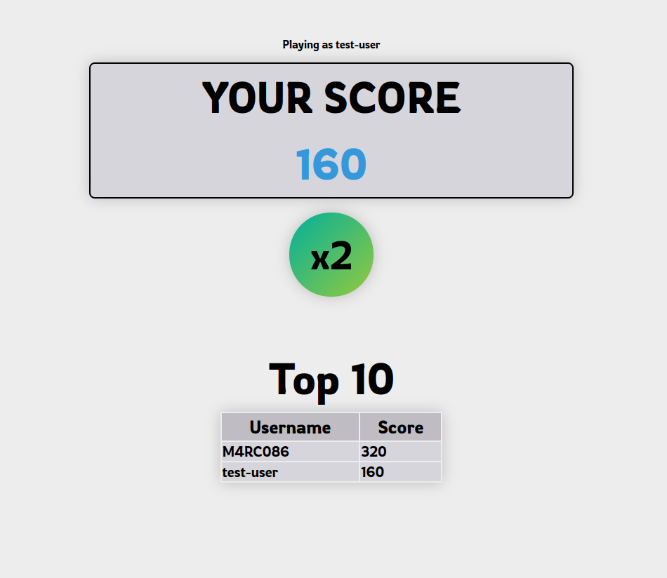

# DOUBLE OR NOTHING


## Description
This is a dead simple web game where you can flip a coin with a possibility to double your score but you can also lose it. The idea is to have the highest score, but with the risk of losing everything if you want an even higher score. There's also a real time leaderboard.


## Local installation
Make sure you have Git and Python installed

```bash
git clone https://github.com/M4RC086/double-or-nothing.git

cd double-or-nothing
```
```bash
python -m venv .venv
source .venv/bin/activate # Linux
```
```bash
pip install -r requirements.txt
```

## Usage

## AI declaration
I didn't know how to use javascript so I used Claude and Deepseek to understand how js works. I took the time to understand what the LLMs were saying.

</br>
<strong>⭐Made for the 2026 Stardance project</strong>